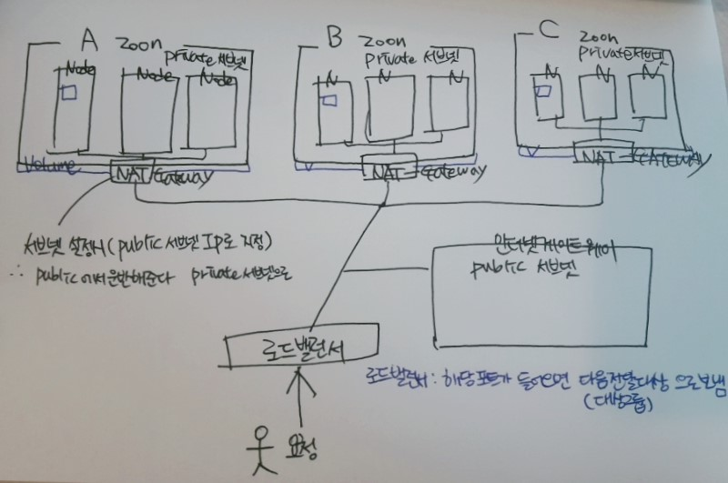

# AWS

AWS란?  

* billLetter-biz 구성.

    가상 컴퓨팅 클라우드 : EC2
    네트워크 : VPC
    스토리지 : EFS 
    호스트 관리 : Route53
    
    가상 프라이빗 클라우드 

* Spot 이란?  
A라는 사용자가 EC2(가상 컴퓨팅)를 일정 기간동안 빌린 상태임.
AWS에서는 A라는 사용자에게  EC2를 일정기간동안 빌려주기로 했기에 A가 요청한 용량을 확보해둠.
A는 빌리고 사용하지 않고 있음.
이때 AWS는 놀고 있는(누군가가 빌려놓고 사용하고 있지 않은 컴퓨팅)을 다른 누군가에게 저렴한 가격에 빌려줌.
 
 

* 서브넷 : 하위 IP 대역.
    라우팅 대상 설정.
    1. NAT 게이트웨이(고정IP) :  
            - 외부에서 네트워크 진입이 불가함.  
            - 내부에서만 사용 가능함 (private)  
            - private 는 NAT 게이트 웨이를 통해서 인터넷을 사용할 수 있다.   
            - zoon별로 각각 따로 설정해주어야 한다.   
            - 서브넷 설정시 private가 아닌 public으로 설정해줘야함. ()  
            - 해당 존이 죽으면 존안에 NAT 게이트 웨이도 죽는다.    
             
    2. 인터넷 게이트웨이 : 외부에서 네트워크로 접근 가능함. (public)
 
    

* zoon이 a,b,c 인 이유. 장애발생시 극복을 위함. 
* 호스트 영역 : 해당 도메인은 어떤 로드밸런서로 전달해 주어야하는 시스템.
* 보안 그룹 : 방화벽 설정.      
* zoon 별로 볼륨 지정 가능.( zoon 하나에 Pod가 몰려 있으면 문제 발생률이 높다.)

