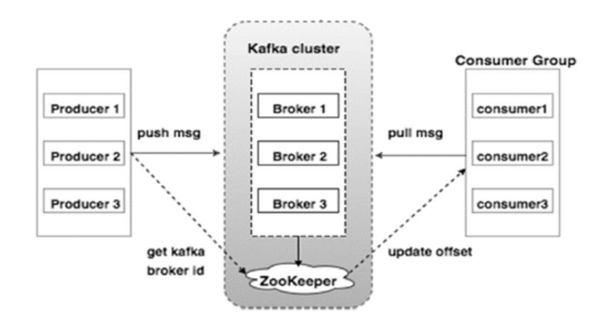
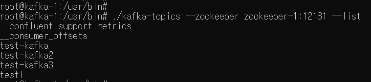
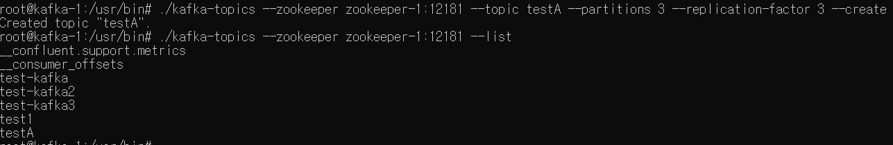
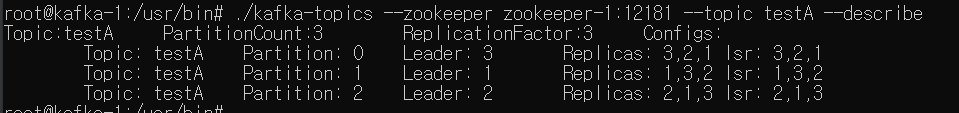
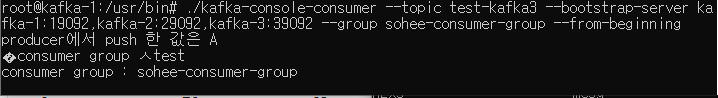
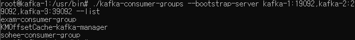
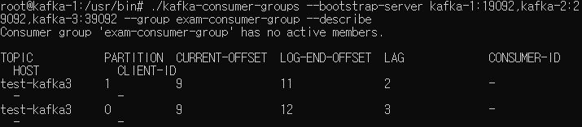
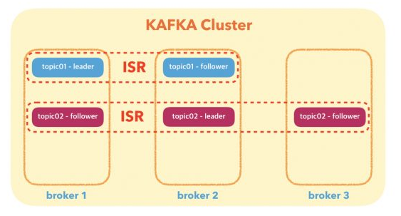

# KAFKA란?

  LinkedIn에서 개발된 분산 메시징 시스템.   전통적인 메시지 큐 시스템과 다르게 broker cluster 여러대로 구성하여 분산처리가 가능하다.
  
    - Producer(프로듀서) : topic에 메시지를 생성한뒤 해당 메시지를 broker에 전달.
    - Consumer(컨슈머) : topic별로 분류해서 쌓아놓아진 메시지들을 가져가서 처리함. 
    - broker(브로커)  : topic을 기준으로 메시지를 관리. 카프카 서버로 이뤄진 클러스터.
    - zookeeper(쥬키퍼) : 
        * 브로커를 하나의 클러스터로 코디네이팅하는 역활. 
        * 클러스터 리더 발탁도 주키퍼가 제공하는 기능을 이용. 
        * 카프카의 노드관리를 해주고 토픽의 offset정보등을 저장하기 위해 필요
        * 주키퍼가 죽으면 카프카도 죽는다. 주키퍼는 과반수 투표방식으로 결정하기 때문에 홀수로 구성해야하고, 과반수 이상 살아있으면 정상 동작한다.
    - partition(파티션) : 각 토픽 당 데이터를 분산 처리하는 단위. 
    - topic(토픽) : 카프카 클러스터에 여러개 생성 가능. 하나의 토픽은 1개 이상의 파티션으로 구성.
    - offset : 메시지의 상대적인 위치. Consumer가 죽었다가 다시 살아나도 마지막으로 읽었던 위치부터 다시 읽어들임.
    - consumerGroup(컨슈머그룹) : 컨슈머 그룹안의 컨슈머 수만큼 파티션의 데이터를 분산처리하게 됨.
      자신이 가져와야하는 토픽 안의 파티션의 데이터를 pull하게 되고 각각 컨슈머 그룹안의 파티션이 나눠져 있는 만큼 데이터를 처리한다. 
 
 * kafka 특징.
    - broker들이 클러스터로 구성되어 동작.
    - 확장성(무중단 확장가능)과 고가용성 
    - broker가 1개밖에 없어도 클러스터는 동작.
    - topic은 partition이라는 단위로 쪼개져 클러스터의 각 서버들에 분산되어 저장됨.    
    - partition복제는 단일 클러스터에서만 가능.
    - 카프카 클러스터에서 데이터를 가져올때는 컨슈머 그룹 단위로 가져오게 된다.
    - 파티션은 운영 도중 그 수를 늘릴수 있지만 절대 줄일수 없다. 파티션 늘리는것은 신중하게 고려해야함.
    - 일반적인 메시지 시스템은 메시지를 읽어가면 큐에서 바로 삭제하지만 카프카는 디스크에 보관 주기 동안 저장.
    
    
 * kafka 아키텍처 및 구성
    -  카프카 클러스터를 중심으로 pull push하는 구조.
    
    

 * console 명령어  
    1. topic 리스트 확인  
     => ./kafka-topics --zookeeper 쥬키퍼 호스트 네임:쥬키퍼port --list
         <
       topic 목록을 보면 4개의 토픽들(test-kafka,test-kafka2,test-kafka3,test1)이 존재한다.
       
    2. topic 생성  
     => ./kafka-topics --zookeeper 쥬키퍼 호스트 네임:쥬키퍼port --topic  testA(추가할 토픽명) --partitions 3(파티션수) --replication-factor 3(복제수) --create
        
              
    3. topic 상세 보기  
     => ./kafka-topics --zookeeper 쥬키퍼 호스트 네임:쥬키퍼port --topic  testA(추가할 토픽명) --describe
        
                 
    4. console producer로 메시지 보내기  
     => ./kafka-console-producer --topic testA(메시지 보낼 토픽명) --broker-list 카프카호스트네임:카프카prot
                     
                           
    5. console consumer로 메시지 사용하기
    => ./kafka-console-consumer --topic testA(가져올 토픽명) --bootstrap-server 카프카 호스트 네임:카프카port --group 컨슈머그룹명지정. --from-beginning   * --from-beginning : 맨 처음부터 메시지를 가져옴.
           
  
    6. consumer 그룹 리스트 확인하기
    => ./kafka-consumer-groups --bootstrap-server 카프카 호스트 네임:카프카port --list
          
    
    7. consumer 그룹 상세 정보 보기.
    => ./kafka-consumer-groups --bootstrap-server 카프카 호스트 네임:카프카port --group 컨슈머그룹네임 --describe
        
        
   - 카프카는 과반수 투표방식을 사용하지 않지만 , Replication Factor를 3으로 할 경우 균일하게 분배하기 위해서 노드 수는 최소 3으로 해야한다.
   (__consumer_offsets 토픽은 기본값이 RF3)     
   
 * leader & fllower
   - rabbitmq : 복제본 2개시. 하나는 master 나머지는 mirrored
   - kafka : 복제본 2개시. 하나는 leader 나머지는 follower(leader와 동일한 데이터 내용을 유지하기 위해 짧은 주기로 leader로 부터 데이터를 가져옴) 
   
          
        
        1. topic 별로 복제본의 갯수를 지정 가능.
        2. topic으로 통하는 모든 데이터의 read/write는 오직 leader에서 이뤄짐.
        3. leader가 있는 broker가 죽으면 . follower중에 리더가 된다.
        
 * 리밸런스 : 컨슈머 그룹안에 컨슈머들은 토픽의 소유권을 공유함. 파티션이 추가되면 소유권이 이동되는데 이를 리밸런스라고 함. 
             리밸런스시 컨슈머 그룹 일시 사용불가. 컨슈머의 데이터를 가져올수 없음.
            
  
 * 컨슈머 그룹 : 하나의 파티션에 대해 컨슈머 그룹내에 하나의 인스턴스만 접근할수 있다.      
 
        
