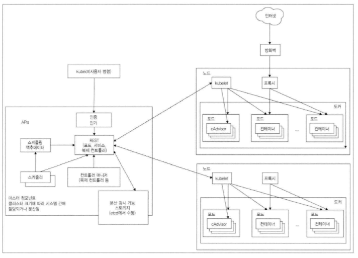
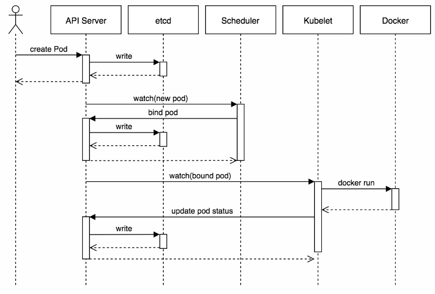

# kubernetes

쿠버네티스란?  
  계속 증가하고 있는 엄청난 수의 서비스와 기능이 포함되니 플랫폼.
  핵심 기능 : 컨테이너 작업 부하를 스케줄할 수 있는 능력.
  주요 임무 : 컨테이너 오케스트레이션
  
* 컨테이너 오케스트레이션
    - 다양한 작업을 실행하는 모든 컨테이너가 물리 장치나 가상 머신에서 실행되도록 예약돼 있는지 확인함.
    - 실행 중인 컨테이너를 모니터링 하여 중지되거나 응답 없거나 상태 불량 컨테이너를 교체함.
    
 * 쿠버네티스 기본 용어
    - Node : 단일 서버일 수도 있고 물리 머신이나 가상머신일 수 잇음. 노드는 포드를 실행시킴. 노드는 쿠버네티스 마스터에 의해 관리됨.
    - 마스터 : 쿠버네티스의 컨트롤 플레인으로 클러스터를 관리. ApI 서버, 스케줄러, 컨트롤러 매니저 등 여러 컴포넌트로 구성.  포드 스케줄링과 이벤트 처리 담당.
    - Pod : 쿠버네티스 작업 단위
    - 라벨 : 키.값 쌍의 객체 집합 주로 포드를 그룹화 할때 사용.
    - Volume : Pod가 기동될때 컨테이너에 마운트해서 사용한다.
    
    
  * Service
  * Pod 복제 관리 
    -  Deployment : 새 ReplicaSet을 만들거나 기존의 배포를 제거 하고 새로운 배포로 모든 리소스 채택(확장하거나 축소해주는 역활을 함.)replicaSet 구성은 현재 Deployment에서 자동으로 구성해줌.
    -  StateFullSet : 복제 시 고유한 명명 규칙을 이름으로 사용해 관리한다. 
    
 ----   
* 쿠버네티스 아키텍처

    
    
    크게 컨트롤 플레인(마스터 노드)과 워커 노드가 있다. 
    
    1. 컨트롤 플레인  
         * 컨트롤 매니저 : 구성요소 복제, 워크노드 추적, 노드 장애 처리.
         * 스케쥴러 : 스케쥴링으로 해당 Pod를 적정 인스턴스에 배정한다.
         * ectd : 쿠버네티스 클러스터가 안전하게 운영될 수 있게 해주는 데이터 저장소. / 분산 환경에서 설정 관리, 서비스 디스커버리, 작업 조율등을 위한 데이터를 저장하는 분산 Key-value 데이터 저장소. 
    
    2. 워커 노드 
         * kube-proxy :  예를 들어 클라이언트가 a를 요청시 a는 A,B,C 존 중 어디에 Pod(a가 있는 위치)가 있는지 모른다. 
                         이때 proxy가 해당 요청을 a가 있는 Pod의 존으로 보내주는 역할을 한다.
        
         * kubelet :  api서버와 통신하고 노드에서 컨테이너 관리.
    
      
           
----
* 네트워킹 기본 용어 
    1. 로드 밸런싱 :  
        - 트래픽(인터넷 송수신을 위한 통신) 부하 분산.
        - 부하 분산을 위해 가상 Ip를 통해 여러 서버에 접속하도록 분배하는 기능   
        - 하나의 서비스(member)를 하나 이상의 노드(서버)가 처리하는 방식으로 작동한다.(분산처리)  
        - 어떤 포트로 들어오면 대상그룹으로 보내라. 부하 분산(라운드 로빈) 방식으로 대상 그룹에 전달.
   
    2. 호스트 영역 :  
        - 해당 도메인을 어떤 로드 밸런서(로드 밸런싱 해주는 장비)로 전달해주어야하는지 지정.     
    
    3. 마운트 :  
        - 디스크를 컴퓨터에 축가하고 파일 시스템으로 생성 후 사용.
    
    4. 온프레미스 :  
        - 클라우드 같은 원격 환경이 아니라 자체적 보유 서버에 하드웨어,소프트웨어,네트워크 등을 직접 설치해 운영하는 방식.
     
    5. 하이퍼 바이저 :  
        - 하나의 컴퓨터 시스템에서 여러개의 운영체계를 가동할 수 있게 하는 가상화 엔진.
        
    6. 프로비저닝 :  
        - 사용자의 요구에 맞게 시스템을 제공 (배치, 복제, 예약, 시작).
            * Server Resource Provisioning : CPU, Memory,IO 서버 자원 할당 , 운영할수 있게 제공
            * OS Provisioning : OS 설치 후 제공
            * Software Provisioning : 소프트웨어 설치하고 세팅하여 제공.
            * Account Provisioning : 접근 권한 계정 제공.
            * Storage Provisioning : 저장소 제공.
            
    * 포터블 : 무설치 프로그램.