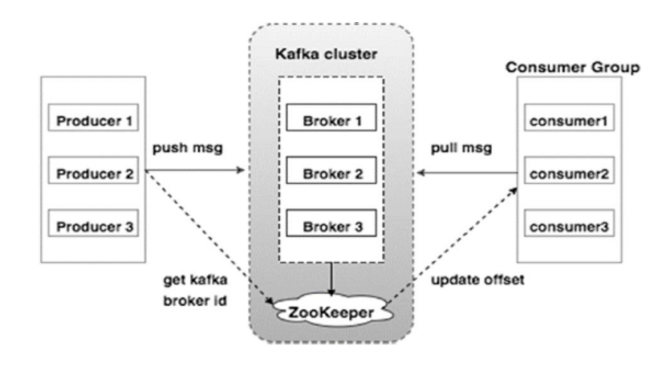

# KAFKA란?

  LinkedIn에서 개발된 분산 메시징 시스템.   대규모 메시지 데이터를 빠르게 처리하도록 개발된 메시징 플랫폼.   
  전통적인 메시지 큐 시스템과 다르게 broker cluster 여러대로 구성하여 분산처리가 가능.  
  사용자의 웹 사이트 활동 추적 파이프라인으로 활용하고 애플리케이션의 통계를 집계해 모니터링 데이터로 사용.  
  사용자의 데이터를 심층적으로 실시간 분석해서 사용해야 하는 수 많은 기업에서 비동기 전용 프레임워크로 도입해 사용.
  
    - Producer(프로듀서) : topic에 메시지를 생성한뒤 해당 메시지를 broker에 전달.
    - Consumer(컨슈머) : topic별로 분류해서 쌓아놓아진 메시지들을 가져가서 처리함. 
    - broker(브로커)  : topic을 기준으로 메시지를 관리. 카프카 서버로 이뤄진 클러스터.
    - zookeeper(쥬키퍼) : 
        * 브로커를 하나의 클러스터로 코디네이팅하는 역활. 
        * 클러스터 리더 발탁도 주키퍼가 제공하는 기능을 이용. 
        * 카프카의 노드관리를 해주고 토픽의 offset정보등을 저장하기 위해 필요
        * 주키퍼가 죽으면 카프카도 죽는다. 주키퍼는 과반수 투표방식으로 결정하기 때문에 홀수로 구성해야하고, 과반수 이상 살아있으면 정상 동작.
    - partition(파티션) : 각 토픽 당 데이터를 분산 처리하는 단위. 
    - topic(토픽) : 카프카 클러스터에 여러개 생성 가능. 하나의 토픽은 1개 이상의 파티션으로 구성.
    - offset : 메시지의 상대적인 위치. Consumer가 죽었다가 다시 살아나도 마지막으로 읽었던 위치부터 다시 읽어들임.
    - consumerGroup(컨슈머그룹) : 컨슈머 그룹안의 컨슈머 수만큼 파티션의 데이터를 분산처리하게 됨.
                                  하나의 파티션에 대해 컨슈머 그룹내에 하나의 인스턴스만 접근할수 있다.  
                                  컨슈머 그룹의 정보는 컨슈머 그룹 리더가 가지고 있고 리밸런스 과정에서 컨슈머에 대한 파티션 소유권을 조정한다.
                                  컨슈머 그룹에 처음으로 속하는 컨슈머가 리더가 된다.
                                  자신이 가져와야하는 토픽 안의 파티션의 데이터를 pull하게 되고 각각 컨슈머 그룹안의 파티션이 나눠져 있는 만큼 데이터를 처리함.
      
    - Replication Factor : 브로커 복제 수.
    - EOP(Exactly Once Problem) : 메세지의 중복 및 소실 없이 정확하게 하나로 발행, 소비하는 것에 관한 문제.
            
    - 리밸런스(re-balance) : 컨슈머 그룹안에 컨슈머들은 토픽의 소유권을 공유함. 파티션이 추가되면 소유권이 이동되는데 이를 리밸런스라고 함.
                             리밸런스시 컨슈머 그룹 일시 사용불가. 컨슈머의 데이터를 가져올수 없음.
             
    - 리어싸인(Re-Assign) : 파티션의 구성을 변경하는 것
    - ISR Shrink : ISR 축소 현상
    - LAG : 브로커에 쌓여있지만 컨슈머가 가져가지 못한 메세지 수 (많을수록 안좋음)
    - commit : consumer가 kafka에서 현재까지 읽은 메시지의 offset을 알려주는 것이 commit이라고 함.

 
 * kafka 특징.
    - broker들이 클러스터로 구성되어 동작.
    - 확장성(무중단 확장가능)과 고가용성 
    - broker가 1개밖에 없어도 클러스터는 동작.
    - topic은 partition이라는 단위로 쪼개져 클러스터의 각 서버들에 분산되어 저장됨.    
    - partition복제는 단일 클러스터에서만 가능.
    - 카프카 클러스터에서 데이터를 가져올때는 컨슈머 그룹 단위로 가져오게 된다.
    - 파티션은 운영 도중 그 수를 늘릴수 있지만 절대 줄일수 없다. 파티션 늘리는것은 신중하게 고려해야함.
    - 일반적인 메시지 시스템은 메시지를 읽어가면 큐에서 바로 삭제하지만 카프카는 디스크에 보관 주기 동안 저장.
    
    
 * kafka 아키텍처 및 구성
    -  카프카 클러스터를 중심으로 pull push하는 구조.
    
    

 * kafka cli 명령어  
    1. topic 리스트 확인  
     => ./kafka-topics --zookeeper 쥬키퍼 호스트 네임:쥬키퍼port --list  
          
       topic 목록을 보면 4개의 토픽들(test-kafka,test-kafka2,test-kafka3,test1)이 존재한다.
       
    2. topic 생성  
     => ./kafka-topics --zookeeper 쥬키퍼 호스트 네임:쥬키퍼port --topic  testA(추가할 토픽명) --partitions 3(파티션수) --replication-factor 3(복제수) --create
        
              
    3. topic 상세 보기  
     => ./kafka-topics --zookeeper 쥬키퍼 호스트 네임:쥬키퍼port --topic  testA(추가할 토픽명) --describe
        
                 
    4. console producer로 메시지 보내기  
     => ./kafka-console-producer --topic testA(메시지 보낼 토픽명) --broker-list 카프카호스트네임:카프카prot
                     
                           
    5. console consumer로 메시지 사용하기
    => ./kafka-console-consumer --topic testA(가져올 토픽명) --bootstrap-server 카프카 호스트 네임:카프카port --group 컨슈머그룹명지정. --from-beginning   * --from-beginning : 맨 처음부터 메시지를 가져옴.  
           
  
    6. consumer 그룹 리스트 확인하기
    => ./kafka-consumer-groups --bootstrap-server 카프카 호스트 네임:카프카port --list 
          
    
    7. consumer 그룹 상세 정보 보기.
    => ./kafka-consumer-groups --bootstrap-server 카프카 호스트 네임:카프카port --group 컨슈머그룹네임 --describe
        
        
    8. offsets 정보 보기.
    => ./kafak-consumer-groups --bootstrap-server 카프카 호스트네임: 카프카port --describe --group 카프카 컨슈머 그룹이름 
    
       
        
   - 카프카는 과반수 투표방식을 사용하지 않지만 , Replication Factor를 3으로 할 경우 균일하게 분배하기 위해서 노드 수는 최소 3으로 해야한다.
   (__consumer_offsets 토픽은 기본값이 RF3)     
   
 * leader & follower
   - rabbitmq : 복제본 2개시. 하나는 master 나머지는 mirrored 라고 부름.
   - kafka : 복제본 2개시. 하나는 leader 나머지는 follower라고 부름(leader와 동일한 데이터 내용을 유지하기 위해 짧은 주기로 leader로 부터 데이터를 가져옴) 
   
          
        
        1. topic 별로 복제본의 갯수를 지정 가능.
        2. topic으로 통하는 모든 데이터의 read/write는 오직 leader에서 이뤄짐.
        3. leader가 있는 broker가 죽으면 . follower중에 리더가 된다.
 
    
 * 옵션.
    - log.retetion.hours : 카프카에서 토픽으로 저장되는 모든 메시지를 해당 시간만큼 보관. * default= 72(4일)
    - delete.topic.enable=true : 디스크가 가득차서 토픽을 삭제함. 옵션 적용이 안되어 있다면 토픽 삭제 불가??
    - log.dirs = /data : 토픽들의 메시지들이 저장되는 실제 경로. 용량이 큰 값의 별도의 디스크 경로로 설정하지 않으면 기본값 /temp/kafka-logs로 설정되어 있어 OS영역의 디스크를 사용하게 되고 용량이 가득차는 경우 발생.
    - enable.auto.commit : 특정 주기마다 자동으로 commit을 하는 경우. * default = true
    - auto.commit.interval.ms : 5000   enable.auto.commit = true 이고 해당값이 5000이면 5초마다 consumer에서 자동적으로 commit하게 된다.  
    - acks란 producer에 보낸 데이터 상태 설정. ( producer configs )
        - acks = 0  : ( 유실률 상 / 속도 상) 프로듀서에 데이터를 보내고 제대로 갔는지 확인응답을 하지 않고 바로 바로 데이터를 이어서 보낸다.  
        - acks = 1  : ( 유실률 중 / 속도 중 ) 프로듀서에 데이터를 보내고 제대로 갔는지 확인응답을 한다.( 카프카의 리더만 체크 follower들은 확인 하지 않음 그렇기에 메시지의 유실이 있을수 있다.) 
        - acks = -1(all)  : ( 유실률 하 / 속도 하 ) 프로듀서에 데이터를 보내고 제대로 갔는지 확인응답을 한다.( 카프카의 리더 + follower 까지 응답확인을 하기에 손실률이 거의 없음. 대신 속도는 체크가 오래걸리기에 떨어진다.) 
        
    - min.insync.replicas 옵션은 프로듀서가 acks=all로 설정히야 메시지 전송시, write 성공하기 위한 최소 복제본 수.
        ex)  성공 = ( 카프카-2 복제-2 파티션-1 min.insync.replicas-1) 일때 -> 리더 1개, 복제 1개 존재 . 이때 최소 복제수 1로 설정했기에 follower로 복제가 되지 않아도 leader는 프로듀서에게 확인 응답을 보낼수 있음.
             실패 = ( 카프카-2 복제-2 파티션-1 min.insync.replicas-2) 일때 -> 리더 1개, 복제 1개 존재 . 이때 최소 복제수 2로 설정했기에 follower로 복제전에 leader가 죽으면 write는 실패로 로그 발생.
             성공 = ( 카프카-3 복제-3 파티션-1 min.insync.replicas-1) 일때 -> 리더 1개, 복제 1개 존재 . 이때 최소 복제수 1
             성공 = ( 카프카-3 복제-3 파티션-1 min.insync.replicas-2) 일때 -> 리더 1개, 복제 1개 존재 . 이때 최소 복제수 2로  follower중 한개만 성공하더라도 성공 . 둘다 복제 실패시 실패 로그 발생.     
