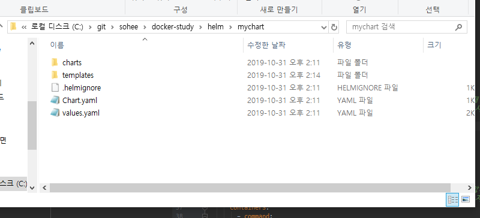

# Helm

1. Helm이란?  
    쿠버네티스 package managing tool.   
    
    kubernetes 클러스터에서 애플리케이션을 설치하고 수명주기를 관리하는 오픈 소스 패키징 도구. (쿠버네티스 패키지를 배포 가능하게 하는 툴.)  
    helm 사용하려면 쿠버네티스 클러스터가 셋팅되어 있어야함.  
    
    * Helm 구성      
       
        - client 서버 :  chart 관리(Helm CLI 도구 . chart 설치 요청등.)
        - tiler 서버 : 클러스터 서버로 chart의 배포, 릴리즈 관리.
        - chart :  쿠버네티스 리소스를 describe 하는 파일들의 집합.  특정 directory 하위에 모여있는 파일들을 chart라 부름.
                   차트를 직접 만들어서 로컬디스크에 보관하거나 커뮤니티에서 유지 관리하는 차트 목록으로 부터 기존 차트를 사용할수 있다.
        
    ① Autentication  
    ② Request to install : 차트를 로컬디스크 or 커뮤니티에서 가져옴.  
    ③ installing Chart   : kubernetes 클러스터에 해당 chart 배포.  
    
    * gRPC : 구글에서 제공하는 오픈소스 rpc(remote procedure call : 원격에서 정의된 프로시져 호출) 프레임워크
    
    
2. Role-based Access Control
    유저 혹은 유저 그룹 마다 다른 권한을 부여해 제한을 준다는 의미. 
    1. Role : API/리소스 별로 권한을 설정. 
    
    default 네임스페이스는 admin 만 유효하다. 
    2. Role/ClusterRole : 
    3. RoleBinding/ClusterRoleBinding :  
    
    특정 helm 클라이언트에게 Tiler 서버에 대한 엑세스 권한을 부여해서 기능(해당 리소스를 특정 네임 스페이스에 배포) 사용을 제한한다.
    클러스터 관리자 권한은 쿠버네티스 클러스터에서 default로 생성해준다.   
        
        
3. local 테스트(windows) 
 
    선행 작업 :  chocolatey software install -> choco install kubernetes-helm(클라이언트 서버에 helm 설치)
 
    a. 차트 생성 명령어 : C:\git\sohee\docker-study\helm> helm create mychart  # 해당 경로에 아래와 같이 차트 디렉토리 생성됨.
        
    
    b. 생성된 차트 아래에 templates 디렉토리에 구성하고자 하는 yaml 파일들 추가. (이때 yaml파일의 이름은 kind와 동일해야함.???)

    c. 차트 배포
        
        
        

4. yaml 파일 내 컬럼값 의미

     

    * Release :  
        {{ .Release.Name }} : helm chart 생성할때 지정했던 helm namespace 이름.
        {{ .Release.Service }} : helm tiler 서버 tag
    * Values :
        {{ .values.xxx }} : values.yaml 파일에 정의된 값 
    * Template:
        {{ template "Kafka.fullname" . }} :  helm chart 생성할때 지정했던 helm namespace 이름. / 하위 chart 경우  생성할때 지정한 [helm namespace]-해당디렉토리 이름.
        {{ template "Kafka.name" . }} : chart.yml 에 기재된 [name]
        {{ template "kafka.chart" . }} : chart.yml 에 기재된 [name]-[version]
        

4. helm 명령어
    
    helm list : 배포된 release 목록을 조회하는 명령어.
    
    helm histroy [배포된 release helm 이름]
    
    helm get manifest [배포된 release helm 이름]

           
           