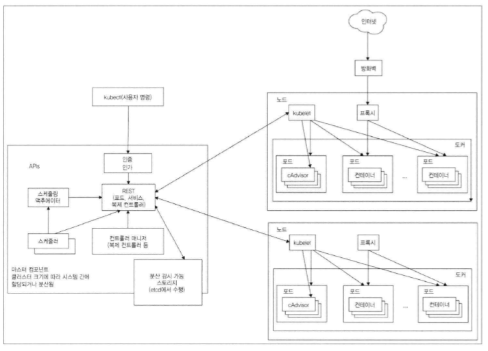
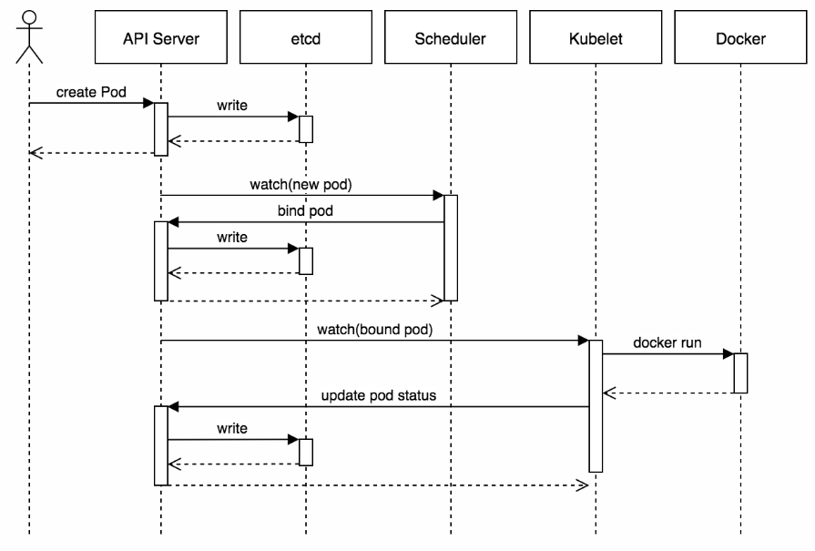

# kubernetes

1. 쿠버네티스란?  
  핵심 기능 : 컨테이너 작업 부하를 스케줄할 수 있는 능력.  
  주요 임무 : 컨테이너 오케스트레이션  
  장점 : 컨테이너의 목록을 제공하고 클러스터에서 컨테이너를 계속 실행시킬 수 있음
  
    * 컨테이너 오케스트레이션
        - 다양한 작업을 실행하는 모든 컨테이너가 물리 장치나 가상 머신에서 실행되도록 예약되있는지 확인함.
        - 실행 중인 컨테이너를 모니터링 하여 중지되거나 응답 없거나 상태 불량 컨테이너를 교체함.
    
    * 쿠버네티스 기본 용어
        - Work Node : 단일 서버일 수도 있고 물리 머신이나 가상머신일 수 잇음. 노드는 포드를 실행시킴. 노드는 쿠버네티스 마스터에 의해 관리됨.
        - Master Node : 쿠버네티스의 컨트롤 플레인으로 클러스터를 관리. ApI 서버, 스케줄러, 컨트롤러 매니저 등 여러 컴포넌트로 구성.  포드 스케줄링과 이벤트 처리 담당함.
        - Pod : 쿠버네티스 작업 단위.  pod 내에는 한개이상의 컨테이너를 가질수 있다.
        - Label : 키.값 쌍의 객체 집합 주로 포드를 그룹화 할때 사용.  
                 Selecotr라고 보면됨. 특정라벨들을 선택해 자원들을 관리할수 있음.   
                 라벨에는 두가지가 있음(등호기반 셀렉터, 집합기반 셀렉터)  
             
        - Volume : Pod가 기동될때 컨테이너에 마운트해서 사용한다. (pod 내 컨테이너들의 메타데이터 저장소. jar파일이나 컨테이너 내에 떠있는 서비스의 데이터.)
        - NameSpace : 객체는 여러개의 라벨을 가질수 있음.  
                      이런 객체의 그룹은 겹칠수 있음.  
                      그래서 객체가 서로 겹치지 않게 하기 위해 별개의 그룹으로 분리하려는게 네임스페이스의 그룹화임.  
                      네임스페이스를 많이 사용시 많은 요소를 더 작은 그룹으로 분할 가능하다.
                      논리적인 분리 단위.
        - ApiVersion : 쿠버네티스 api 버전.
        - ConfigMap : application 의 구성 혹은 shell script
        - Secret : 보안값. HTTPS ,letsencrypt 에서 인증값 받음.   
        - kind 종류       
             1. pod 관리 컨트롤러 : ( pod 생성 및 관리. )      
                 - ReplicationController(RC), ReplicaSet(RS), Deployment  
                      * pod관리 컨트롤러 여러노드에 비균등하게 배포한다.  
                      * 스케줄링으로 어떤 노드에 Pod를 보냄. (복제가능)  
                      * pod의 라벨을 수동으로 변경시 해당 pod는 더이상 RC, RS, Deployment의 관리를 받지 않는다.  
                      * deployment는 새 ReplicaSet을 만들거나 기존의 배포를 제거 하고 새로운 배포로 모든 리소스 채택(확장하거나 축소해주는 역할을 함.)
                 - DaemonSet :   
                      * 모든 노드에 균등하게 pod를 배포한다. 
                      * spec.template.spec.nodeSelector 설정을 통해 특정 노드에만 pod 배포가능하다. 
                      * 복제 개념이 아니기에 해당 노드가 죽어도 노드내의 포드가 다른 노드에 생성되지는 않음.스케줄러를 수행하지 않음.
                 - Job  
                 - CronJob  
                 - StateFullSet : 복제 시 고유한 명명 규칙을 이름으로 사용해 관리한다. (포드의 위치를 어딘가에서 가지고 있어서 포드가 죽더라도 해당 위치에 다시 뜰 수 있다.)      
                 
             2. service 간의 로드밸런싱 기능을 제공하는 컴포넌트           
                 - Ingress
             3. 동일한 서비스를 제공하는 포드 그룹에 단일 진입 점을 만들기 위해 생성하는 리소스, pod IP그룹화 ,로드밸런서 역할. 고유한 DNS 이름을 가질수 있다.       
                 - Service
       
        - Metadata : 리소스의 각종 메타 데이터를 넣는다. label이나 설명 데이터 
        - Spec(스펙) : 포드의 컨테이너, 볼륨, 포드 내용의 실제 설명을 설정한다.
        - Status(상태) : 포드의 상태, 각 컨테이너의 설명 및 상태, 포드 내부의 IP 및 그 밖의 기본 정보등을 실행중인 포드의 현재 정보를 설정한다.      
        - Replicas : 포드의 갯수.       
   
    * Q&A?
        * 포드(컨테이너 그룹화)는 왜 필요할까? 
            여러 프로세스를 하나의 컨테이너에서 실행시키면 모든 프로세스를 관리해야하는데 관리가 어려움.   
            컨테이너는 프로세스 자체가 하위 프로세스를 생성하지 않는 이상 한 컨테이너 당 하나의 프로세스만 실행되게 설계됨.  
            여러개의 프로세스를 하나의 묶어서 관리해야하는데 컨테이너로는 묶을수 없기에 포드가 존재하는 것임.  
            포드를 사용하게 되면 여러 프로세스가 하나의 컨테이너에서 실행되는 것처럼 느껴짐. 
            
            IPC : 인터넷 프로세싱 통신. 여러개의 프로세스의 통신. 
            
        * 하나의 포드에 하나의 컨테이너로만 구성해야하는것일까?
            포드는 배포된 컨테이너간의 디스크 볼륨을 공유할 수 있음.
            예를 들어 하나의 포드에 세개의 서비스를 기동시킨다고 하자. 
            컨테이너간의 볼륨이 공유되기때문에.  
            세개의 서비스의 로그 메시지는 a라는 volume에 다른 내용은 b라는 volume으로 각각 분류해서 관리할수 있다.  
            그렇기에 상황에따라서 구성하면 된다.
            
        * 서비스는 왜필요할까?
            포드는 내부 IP를 가지고 있음.  
            노드가 다운되거나. 포드 삭제시.  
            레플리케이션 컨트롤러에 의해 포드가 설정에 맞춰서 하나더 생성됨.   
            이때 새로 생성된 포드의 내부 ip주소는 다른 주소로 잡히게 됨.   
            고정 IP가 아님.   
            그렇기 때문에 서비스 생성시 정적 IP를 할당받고.   
            이 서비스는 위치와 상관없이 포드 중 하나를 연결시킴.     
            서비스는 포드들을 하나의 그룹으로 묶어서 관리하기 위해서 필요함.   
            
        * 포드를 단일로 구성하지 않는 이유는 무엇일까?
           단일 워커 노드만 사용하면 두번째에서 사용하는 워커노드의 연산 리소스는 활용하지 않음.  
           포드는 스케일링이 기본단위인데.  
           개별 컨테이너는 내부에서 수평적으로 확장이 불가능.  
           그렇기 때문에 포드의 수를 늘려 관리한다.     
           
        * 쿠버네티스를 수동으로 재실행 시켜야하는 케이스  
                ○ 애플리케이션이 프로세스의 충돌 없이 작동 중단 되는 경우. OutOfMemorry 발생시에는 쿠버네티스에 오작동 신호를 보내고 쿠버네티스를 재실행시켜야한다.  
                ○ 애플리케이션이 무한 루프 또는 교착상태에 빠져서 응답을 멈추는 상황도 있다. 이런 경우는 애플리케이션을 재실행시킬수 있도록 상태를 외부에서 체크하고 내부에서 수행하는 애플리케이션에 의존하지 말아야함.
      
2. 쿠버네티스 아키텍처
 
     
     
     크게 컨트롤 플레인(마스터 노드)과 워커 노드가 있다. 
     
     1. 컨트롤 플레인  (마스터 노드) : 컨트롤 플레인 컨포넌트
          * kube-api 서버 : 쿠버네티스의 모든 기능들을 REST API로 제공하고 그에 대한 명령을 처리한다.
          * 컨트롤 매니저 : 구성요소 복제, 워크노드 추적, 노드 장애 처리.
          * 스케쥴러 : 스케쥴링으로 해당 Pod를 적정 인스턴스에 배정한다.
          * ectd : 쿠버네티스 클러스터가 안전하게 운영될 수 있게 해주는 데이터 저장소.  
                   분산 환경에서 설정 관리, 서비스 디스커버리, 작업 조율등을 위한 데이터를 저장하는 분산 Key-value 데이터 저장소. 
     
     2. 워커 노드 
          * kube-proxy :  마스터의 kube-api 서버와 통신을 하면서 노드의 네트워크 규칙을 유지 관리.   
                          예를 들어 클라이언트가 a를 요청시 a는 A,B,C 존 중 어디에 Pod(a가 있는 위치)가 있는지 모른다.  
                          이때 proxy가 해당 요청을 a가 있는 Pod의 존으로 보내주는 역할을 한다.  
         
          * kubelet :  api서버와 통신하고 노드에서 컨테이너 관리.
     
       
            
3. 쿠버네티스 명령어
 
       kubectl get [all,po(pod),no(node),svc(service),rc(ReplicationController),rs(ReplicaSet)] : 쿠버네티스 요청값 상세보기]
      
       kubectl create -f 파일이름 : 파일(docker-compose.yml)로 된 형태 생성.
        
    	kubectl get po
    	
    	kubectl describe po <pod이름>
    	
    	kubectl get po <pod 이름> -o yaml
    	
    	kubectl get po --show-labels   : 라벨 모두 보기.
    	
    	kubectl scale rc <리플리케이션이름> --replicas=파드수 지정. : 파드갯수 스케일링하기.
    	
    	kubectl get po --n <네임스페이스 이름> : 해당 네임스페이스로 이뤄진 포드 보기.
